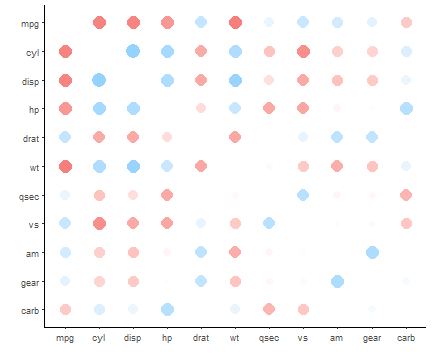

Exploring correlations in a tidy R framework with corrr
========================================================
author: Dr Simon Jackson
date: January 13, 2017
autosize: true
css: custom.css
font-family: 'Arial'

Presented at rstudio::conf, 2017

[@drsimonj](https://twitter.com/drsimonj)

Motivation
========================================================

- Correlations are fundamental measures of association.
- We want to explore them.
- We should explore them!

Motivation
========================================================

But exploring correlations in R often means working with matrices and base R.


```r
cor(mtcars[1:6])
```

```
            mpg        cyl       disp         hp       drat         wt
mpg   1.0000000 -0.8521620 -0.8475514 -0.7761684  0.6811719 -0.8676594
cyl  -0.8521620  1.0000000  0.9020329  0.8324475 -0.6999381  0.7824958
disp -0.8475514  0.9020329  1.0000000  0.7909486 -0.7102139  0.8879799
hp   -0.7761684  0.8324475  0.7909486  1.0000000 -0.4487591  0.6587479
drat  0.6811719 -0.6999381 -0.7102139 -0.4487591  1.0000000 -0.7124406
wt   -0.8676594  0.7824958  0.8879799  0.6587479 -0.7124406  1.0000000
```

corrr
========================================================

**corrr** makes it easy to explore **corr**elations in **R**.

- Work with data frames instead of matrices.
- Designed on, and to leverage, tidyverse tools.
- Data frames in and out means pipelines `%>%`

API
========================================================

Install and load corrr to use functions that:

- **Create a correlation data frame**
- Print and visualize correlations
- Make internal changes (stay square)
- Reshape the data frame (go rectangle)


```r
# Install from CRAN
# install.packages("corrr")

# Or latest development version from GitHub
# devtools::install_github("drsimonj/corrr")

library(corrr)
```

Create a correlation data frame
========================================================


Create a correlation data frame  (tibble)
========================================================


```r
correlate(mtcars)
```

```
# A tibble: 11 × 12
   rowname        mpg        cyl       disp         hp        drat
     <chr>      <dbl>      <dbl>      <dbl>      <dbl>       <dbl>
1      mpg         NA -0.8521620 -0.8475514 -0.7761684  0.68117191
2      cyl -0.8521620         NA  0.9020329  0.8324475 -0.69993811
3     disp -0.8475514  0.9020329         NA  0.7909486 -0.71021393
4       hp -0.7761684  0.8324475  0.7909486         NA -0.44875912
5     drat  0.6811719 -0.6999381 -0.7102139 -0.4487591          NA
6       wt -0.8676594  0.7824958  0.8879799  0.6587479 -0.71244065
7     qsec  0.4186840 -0.5912421 -0.4336979 -0.7082234  0.09120476
8       vs  0.6640389 -0.8108118 -0.7104159 -0.7230967  0.44027846
9       am  0.5998324 -0.5226070 -0.5912270 -0.2432043  0.71271113
10    gear  0.4802848 -0.4926866 -0.5555692 -0.1257043  0.69961013
11    carb -0.5509251  0.5269883  0.3949769  0.7498125 -0.09078980
# ... with 6 more variables: wt <dbl>, qsec <dbl>, vs <dbl>, am <dbl>,
#   gear <dbl>, carb <dbl>
```

Bonus: pairwise deletion used.  
No more `use = "pairwise.complete.obs`"

Leverage the tidyverse
========================================================


```r
# dplyr is loaded with corrr

correlate(mtcars) %>% 
  select(rowname, mpg:hp) %>% 
  filter(mpg > .3)
```

```
# A tibble: 5 × 5
  rowname       mpg        cyl       disp         hp
    <chr>     <dbl>      <dbl>      <dbl>      <dbl>
1    drat 0.6811719 -0.6999381 -0.7102139 -0.4487591
2    qsec 0.4186840 -0.5912421 -0.4336979 -0.7082234
3      vs 0.6640389 -0.8108118 -0.7104159 -0.7230967
4      am 0.5998324 -0.5226070 -0.5912270 -0.2432043
5    gear 0.4802848 -0.4926866 -0.5555692 -0.1257043
```

Get fashionable
========================================================


```r
correlate(mtcars) %>% fashion()
```

```
   rowname  mpg  cyl disp   hp drat   wt qsec   vs   am gear carb
1      mpg      -.85 -.85 -.78  .68 -.87  .42  .66  .60  .48 -.55
2      cyl -.85       .90  .83 -.70  .78 -.59 -.81 -.52 -.49  .53
3     disp -.85  .90       .79 -.71  .89 -.43 -.71 -.59 -.56  .39
4       hp -.78  .83  .79      -.45  .66 -.71 -.72 -.24 -.13  .75
5     drat  .68 -.70 -.71 -.45      -.71  .09  .44  .71  .70 -.09
6       wt -.87  .78  .89  .66 -.71      -.17 -.55 -.69 -.58  .43
7     qsec  .42 -.59 -.43 -.71  .09 -.17       .74 -.23 -.21 -.66
8       vs  .66 -.81 -.71 -.72  .44 -.55  .74       .17  .21 -.57
9       am  .60 -.52 -.59 -.24  .71 -.69 -.23  .17       .79  .06
10    gear  .48 -.49 -.56 -.13  .70 -.58 -.21  .21  .79       .27
11    carb -.55  .53  .39  .75 -.09  .43 -.66 -.57  .06  .27     
```

Get visual
========================================================


```r
correlate(mtcars) %>% network_plot()
```


Get visual
========================================================


```r
correlate(mtcars) %>% rplot()
```



Find patterns
========================================================


```r
correlate(mtcars) %>% rearrange() %>% rplot()
```


Focus in
========================================================


```r
correlate(mtcars) %>% focus(mpg, drat)
```

```
# A tibble: 9 × 3
  rowname        mpg        drat
    <chr>      <dbl>       <dbl>
1     cyl -0.8521620 -0.69993811
2    disp -0.8475514 -0.71021393
3      hp -0.7761684 -0.44875912
4      wt -0.8676594 -0.71244065
5    qsec  0.4186840  0.09120476
6      vs  0.6640389  0.44027846
7      am  0.5998324  0.71271113
8    gear  0.4802848  0.69961013
9    carb -0.5509251 -0.09078980
```

Did I mention the tidyverse?
========================================================


```r
library(ggplot2)
correlate(mtcars) %>% focus(mpg) %>%
  mutate(rowname = reorder(rowname, mpg)) %>% 
  ggplot(aes(rowname, mpg, fill = mpg)) +
    geom_col() +
    labs(x = NULL, y = "Correlation with mpg") +
    coord_flip() + guides(fill = "none") + theme_minimal()
```


