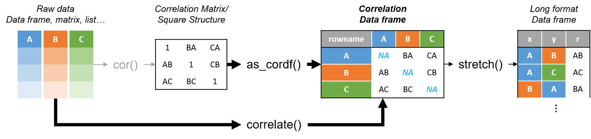
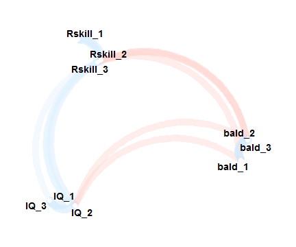

Exploring correlations in a tidy R framework with corrr
========================================================
author: Dr Simon Jackson
date: January 13, 2017
autosize: true
css: custom.css
font-family: 'Arial'

Presented at rstudio::conf, 2017

[@drsimonj](https://twitter.com/drsimonj)


Motivation
========================================================
transition: none
incremental: true

As part of a national research project, I collected data from 1000 Australians about their:

**IQ**  


Motivation
========================================================
transition: none

As part of a national research project, I collected data from 1000 Australians about their:

**R skill**  


Motivation
========================================================
transition: none

As part of a national research project, I collected data from 1000 Australians about their:

**Baldness**  


Motivation
========================================================
transition: none

As part of a national research project, I collected data from 1000 Australians about their:


```r
head(d, 3)
```

```
         IQ_1       IQ_2       IQ_3   Rskill_1   Rskill_2    Rskill_3
1 -0.11799721 -0.7392698 -0.6747767 -0.6960839 -0.5367043 -0.61625979
2  0.40704571 -1.4477217  0.4841486  1.1862742  1.0192495  1.36081114
3 -0.02605936  0.2724224 -0.1837364 -0.5016459 -1.5029427 -0.01913065
       bald_1     bald_2      bald_3
1 -0.06887305 -0.9494054  0.64946115
2 -0.40052009 -0.2932141 -0.02779331
3 -0.47746994  0.7706985  0.12044271
```

Motivation
========================================================

But exploring the correlations meant working with matrices...


```r
cor(d)
```

```
               IQ_1       IQ_2       IQ_3   Rskill_1   Rskill_2   Rskill_3
IQ_1      1.0000000  0.4803999  0.4369312  0.2866469  0.3196786  0.3017266
IQ_2      0.4803999  1.0000000  0.4451631  0.2798004  0.3020919  0.3251597
IQ_3      0.4369312  0.4451631  1.0000000  0.2840341  0.3075566  0.2948236
Rskill_1  0.2866469  0.2798004  0.2840341  1.0000000  0.4445312  0.4216245
Rskill_2  0.3196786  0.3020919  0.3075566  0.4445312  1.0000000  0.4266115
Rskill_3  0.3017266  0.3251597  0.2948236  0.4216245  0.4266115  1.0000000
bald_1   -0.2937423 -0.3110973 -0.2914030 -0.2211088 -0.3182570 -0.2994670
bald_2   -0.2896269 -0.3117055 -0.2503099 -0.2785966 -0.3029422 -0.3121427
bald_3   -0.2977496 -0.2968287 -0.2524835 -0.2827164 -0.3080645 -0.2862883
             bald_1     bald_2     bald_3
IQ_1     -0.2937423 -0.2896269 -0.2977496
IQ_2     -0.3110973 -0.3117055 -0.2968287
IQ_3     -0.2914030 -0.2503099 -0.2524835
Rskill_1 -0.2211088 -0.2785966 -0.2827164
Rskill_2 -0.3182570 -0.3029422 -0.3080645
Rskill_3 -0.2994670 -0.3121427 -0.2862883
bald_1    1.0000000  0.4608222  0.4553511
bald_2    0.4608222  1.0000000  0.4855416
bald_3    0.4553511  0.4855416  1.0000000
```

Motivation
========================================================

... when we have so many fantastic tools for working with data frames!

corrr
========================================================

**corrr** makes it easy to explore **corr**elations in **R** by helping to create and work with correlation data frames.



Using corrr
========================================================

Install from CRAN...


```r
install.packages("corrr")
```

... or GitHub ...


```r
install.packages("devtools")
devtools::install_github("drsimonj/corrr")
```

... and load


```r
library(corrr)
```

Create a correlation data frame  (tibble)
========================================================


```r
correlate(d)
```

```
# A tibble: 9 × 10
   rowname       IQ_1       IQ_2       IQ_3   Rskill_1   Rskill_2
     <chr>      <dbl>      <dbl>      <dbl>      <dbl>      <dbl>
1     IQ_1         NA  0.4803999  0.4369312  0.2866469  0.3196786
2     IQ_2  0.4803999         NA  0.4451631  0.2798004  0.3020919
3     IQ_3  0.4369312  0.4451631         NA  0.2840341  0.3075566
4 Rskill_1  0.2866469  0.2798004  0.2840341         NA  0.4445312
5 Rskill_2  0.3196786  0.3020919  0.3075566  0.4445312         NA
6 Rskill_3  0.3017266  0.3251597  0.2948236  0.4216245  0.4266115
7   bald_1 -0.2937423 -0.3110973 -0.2914030 -0.2211088 -0.3182570
8   bald_2 -0.2896269 -0.3117055 -0.2503099 -0.2785966 -0.3029422
9   bald_3 -0.2977496 -0.2968287 -0.2524835 -0.2827164 -0.3080645
# ... with 4 more variables: Rskill_3 <dbl>, bald_1 <dbl>, bald_2 <dbl>,
#   bald_3 <dbl>
```

Bonus: pairwise deletion used.  
No more `use = "pairwise.complete.obs`"

Leverage the tidyverse
========================================================


```r
# dplyr is loaded with corrr

correlate(d) %>% 
  select(rowname, contains("_1")) %>% 
  filter(bald_1 > 0)
```

```
# A tibble: 2 × 4
  rowname       IQ_1   Rskill_1    bald_1
    <chr>      <dbl>      <dbl>     <dbl>
1  bald_2 -0.2896269 -0.2785966 0.4608222
2  bald_3 -0.2977496 -0.2827164 0.4553511
```

What else?
========================================================

Other corrr functions support routine exploration.

Examples...

Get visual
========================================================


```r
correlate(d) %>% network_plot()
```



Get fashionable
========================================================


```r
correlate(d) %>% fashion()
```

```
   rowname IQ_1 IQ_2 IQ_3 Rskill_1 Rskill_2 Rskill_3 bald_1 bald_2 bald_3
1     IQ_1       .48  .44      .29      .32      .30   -.29   -.29   -.30
2     IQ_2  .48       .45      .28      .30      .33   -.31   -.31   -.30
3     IQ_3  .44  .45           .28      .31      .29   -.29   -.25   -.25
4 Rskill_1  .29  .28  .28               .44      .42   -.22   -.28   -.28
5 Rskill_2  .32  .30  .31      .44               .43   -.32   -.30   -.31
6 Rskill_3  .30  .33  .29      .42      .43            -.30   -.31   -.29
7   bald_1 -.29 -.31 -.29     -.22     -.32     -.30           .46    .46
8   bald_2 -.29 -.31 -.25     -.28     -.30     -.31    .46           .49
9   bald_3 -.30 -.30 -.25     -.28     -.31     -.29    .46    .49       
```

Find patterns
========================================================


```r
correlate(mtcars) %>% rearrange() %>% rplot()
```


Did I mention the tidyverse?
========================================================


```r
library(ggplot2)
correlate(d) %>% focus(bald_1) %>%
  mutate(rowname = reorder(rowname, bald_1)) %>% 
  ggplot(aes(rowname, bald_1, fill = bald_1)) +
    geom_col() + coord_flip() + guides(fill = "none") + 
    labs(x = NULL, y = "Correlation with bald_1") + theme_minimal()
```


Sign off
========================================================

Thanks to:


- you!
- the community helping to improve corrr.
- RStudio for having me.
 
[@drsimonj](https://twitter.com/drsimonj)

[github.com/drsimonj](https://github.com/drsimonj)
